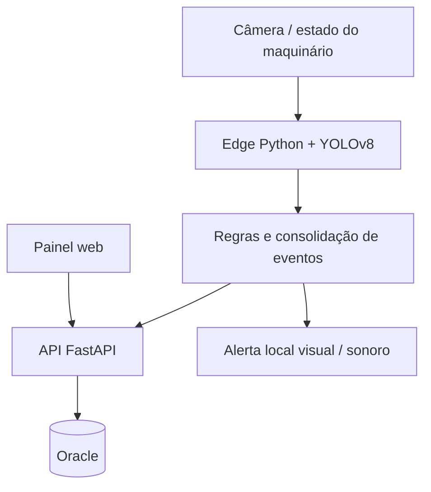

# Refinamento de arquitetura — Sprint 3

**Status: proposta técnica para revisão do grupo.** O ZIP contém documentação e diagramas, não código executável. Os contratos abaixo não são endpoints verificados. A base menciona Python/YOLOv8, Flask ou FastAPI e Oracle; esta proposta escolhe FastAPI para remover a ambiguidade, sujeita à confirmação com a implementação real.

## Componentes e responsabilidades

- **Edge:** captura e inferência local; não enviar vídeo contínuo para nuvem. A captura desta proposta utiliza webcam local, conforme RNF04.
- **Regras:** aplicar perfil vigente por setor, consolidar frames em ocorrências e evitar alertas duplicados por frame.
- **API:** validar entradas, controlar acesso de supervisor/gestor, servir histórico, registrar tratamento e auditar alterações.
- **Oracle:** armazenar metadados de ocorrência, versão das regras e eventos de tratamento.
- **Painel:** consumir a API; não calcular uma segunda regra de aptidão independente.

O Figma representa interface e interação simuladas. Não comprova integração de API, inferência ou persistência.

## Decisões propostas

| Decisão | Motivo | Consequência / validação |
|---|---|---|
| FastAPI para serviço HTTP | Unificar a alternativa Flask/FastAPI descrita na base | Confirmar framework utilizado antes de aprovar |
| Inferência desacoplada da API | Evitar bloquear consultas enquanto frames são processados | Definir fila/limite de carga após medir hardware |
| Ocorrência consolidada, não um log por frame | Evitar repetição de alerta e crescimento excessivo | Calibrar janela temporal em testes reais |
| Versionar perfil aplicado | Histórico deve refletir a regra usada naquele momento | Guardar referência de versão/snapshot |
| Trilha de tratamento separada da detecção | Ação administrativa não altera evidência original | Alteração autenticada com data e autor |
| INDETERMINADO como estado adicional | Ausência de sinal não prova conformidade | Registrar refinamento de RF03 e validar com grupo |

## Modelo de dados proposto

| Entidade | Campos essenciais | Relações |
|---|---|---|
| PerfilFuncao | id, nome, setor, versão, EPIs obrigatórios | 1 perfil → N ocorrências; histórico de versões |
| InferenciaEPI | id, câmera, instante, detecções com confiança | N inferências podem compor 1 ocorrência |
| RegistroLog / Ocorrencia | id, início/fim, setor, câmera, aptidão, EPIs ausentes, versão do perfil | 1 ocorrência → 0..1 alerta consolidado |
| AlertaRisco | id, ocorrência, situação, criadoEm | 1 alerta → N tratamentos |
| TratamentoAlerta | id, alerta, autorSupervisor, instante, ação, observação, versão | Registros de auditoria preservados |

Este refinamento substitui, **na proposta**, o booleano isolado `foiTratado` por estado e trilha, e amplia `estaApto` para enumeração APTO/INAPTO/INDETERMINADO. A relação 1:1 inferência/log da base passa a consolidação N:1; definir janela e retenção antes de implementar. O documento DICIONARIO.md original foi preservado como referência histórica, devendo ser consolidado após aceite.

## Contratos HTTP propostos

| Método e rota | Finalidade | Validações / retorno |
|---|---|---|
| GET /api/ocorrencias | Consulta de histórico | inicio, fim, setor, epi, situacao, pagina, tamanho; 200 com itens/total; 400 período inválido |
| GET /api/ocorrencias/{id} | Detalhe da ocorrência | 200 metadados/tratamentos; 404 inexistente |
| POST /api/alertas/{id}/tratamentos | Iniciar atendimento ou resolver | ação, observação, versão; autor da sessão; 201 sucesso, 400 inválido, 409 conflito |
| GET /api/perfis | Regras por função | 200 perfis e versões |
| PUT /api/perfis/{id} | Alterar regras | Permissão de supervisor; cria nova versão |
| GET /api/relatorios | Consolidar período/setor | Mesmos filtros aplicáveis e tratamento de consulta vazia |

Datas trafegam em ISO 8601 com fuso; a interface informa o fuso usado na exibição. Paginação limita consultas. Falha de conexão preserva os filtros/observação no cliente, mas não apresenta sucesso antes da confirmação da API. Uma repetição após timeout deve consultar o estado ou usar chave de idempotência para não duplicar tratamento.

## Estados e falhas

- Monitoramento: **Ativo**, **Standby** (maquinário desligado) ou **Indisponível** (câmera/serviço sem dados válidos).
- Aptidão: **APTO** (regras atendidas em observação válida), **INAPTO** (não conformidade detectada) ou **INDETERMINADO** (dados insuficientes, obsoletos ou ambíguos). Limiar e tempo de validade são parâmetros a medir.
- Atendimento: **Aberto**, **Em atendimento**, **Resolvido**. Resolver não comprova nova conformidade.
- Queda do banco: indicar persistência pendente/falha, preservar evento para nova tentativa de forma limitada; nunca confirmar salvamento inexistente.
- Texto anterior sobre “máquina parada” é simulação de interface: este recorte não implementa comando de parada física de equipamento industrial.

## Qualidade a verificar

- RNF02 (precisão >90%) é meta, não resultado comprovado. A confiança exibida por detecção não é precisão do modelo.
- Registrar conjunto de avaliação, métrica por classe, hardware, FPS e latência de ponta a ponta antes de afirmar desempenho.
- Não identificar nominalmente a pessoa detectada; nome do supervisor somente para autoria administrativa autenticada.
- Controlar permissões de consulta/configuração/tratamento; parâmetros do banco via configuração protegida.
- Definir retenção de logs e capturas com o grupo. Vídeo em nuvem permanece fora do escopo do ZIP.
